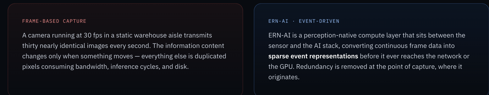

# Content-1

## 1 Summary

The NuMorph.ai website has a number of missteps in the production of website content. The purpose of the site is to present the technology and company direction for possible licensing partners/customers, investors and the curious. It does this very poorly - summarized in 2 Main Content Gaps below.

This audit has the following steps

- Current Site Audit: Voice-over video audit of the current website describing some of the issues I found. Also produce 1 page summary of audit, gaps and summary statements of other steps in Content Audit process.
- Section Intentions: Voice over of a very simply stack of section representing the main ideas of the website. These describe the purpose of sections for each page and what concept/idea is intended to be communicated. That is our starting point. Once we esablish that we can start to think about the details that support that goal. This will take up the same amount of vertical space as the curent page so will be large blocks of whitespace with a small amount of centered text
- Wireframe Walkthu: Upon completing a more indepth content elicitationa nd exploration process with NuMorph team, produce a higher fidelity website with improved headlines and just wireframe grey box divs that indicate where text content, images and diagrams would go with a one line summary of what you would find.

### 2 Main Content Gaps

- Use of markup conventions used by LLMs such as eyebrow tag which are tell-tale signs of LLM generated content.

- Lazy visual representations.
  
  THis image uses html markup to compare and contrast before and after. Ideally this is an actual diagram showing the points of differentiation. That takes more compute than two columns of html text. We can spend the time to get this right.

- Content that reads like the end of a conversation, not the introduction to a topic. For exmaple, this headline on the home page: "The transition from frame-based perception to event-driven intelligence, without replacing existing cameras." That is not a section header. THe eyebrow before it says WHY NUMORPH, WHY NOW. So it's a two parts. But that's not how a paragraph section works. THat's sloppy writing that leans on that conversational dynamic of Q and A. A headline operates under very different conventions.

- The Signal-to-Noise Ratio (Nomenclature Overload): Right now, the page drops a lot of heavy acronyms all at once—ERN-AI, ALB, NESA, TAM, CMOS. It creates a bit of cognitive friction for a fresh reader. I’d suggest a "one acronym per section" rule so people don't get bogged down in the jargon before they even understand the value.Data

- Compression (Verbose Copy): The copy suffers from high redundancy. Phrases like "perception-native" and "point where sensing happens" pop up repeatedly across the modules. If we condense the "Why NuMorph" pillars down into tight, single-sentence takeaways, the core payload will hit much harder.

- Narrowing the Mission Parameters (Use Cases): The text and the video transcript try to solve for almost every vertical simultaneously—from smart cities and aviation to medical tech and space. For an initial hook, it might be cleaner to focus strictly on the immediate commercial targets (like Factory Automation and Robotics), and move the rest into a "Future Horizons" section.

- Demystifying the "Black Box": The honeybee neurology metaphor is a fantastic differentiator, but for a non-scientist, it’s still a bit of a black box. A simple 3-step physical analogy on the landing page would bridge the gap instantly: (1) Standard cameras waste energy processing static walls, (2) Bees only compute motion changes, (3) NuMorph brings that efficiency to existing hardware without replacing a single lens.🚀

### Section Intention

#### Home

1. Overview of company, product and vision in simplest terms
2. What is the technology in simplest terms
3. What problem does it solve in simplest terms
4. Overview of Applications
5. What is NuMorph AI's competitive advantage
6. Book a demo

#### Technology

1. More detailed statement of the technology breaking is up into different parts. We assume 4 parts for purposes of this audit.
2. Acronym definition and links to gloassary entry
3. Simple restatement of first aspect with technical drill down.
4. Simple restatement of second aspect with more complex technical drill down
5. Simple restatement of third aspect with more complex technical drill down
6. Simple restatement of fourth aspect with more complex technical drill down
7. Further resources, techical details, book a demo

#### Solutions

1. NO IR Video Camera Operation
   - Current unmet need
   - NuMorph technological solution
   - projected outcomes and test comnfirmations

2. Warehouse Robotics
   - Current unmet need
   - NuMorph technological solution
   - projected outcomes and test comnfirmations

3. Facory Automation
   - Current unmet need
   - NuMorph technological solution
   - projected outcomes and test comnfirmations

4. Solution 4
   - Current unmet need
   - NuMorph technological solution
   - projected outcomes and test comnfirmations

### Claude Audit Reflections

_Written by Claude Code, 2026-09-14. Figures verified against `first-draft/` as rebuilt that day._

#### How the rebuild changed the audit's baseline

Before this audit was reviewed, the site in `first-draft/` was rebuilt from `docs/seed-docs/`. The
seed docs come in two generations: five pages were **revised** (home, company, technology,
solutions, faq — the `.docx` files) and three were left **unrevised** (blog, glossary,
careers — still `.md`). The rebuild treated the seed docs as source of truth and removed
everything on the live site that they did not contain.

That means several findings below are already closed. Re-auditing the live numorph.ai would
reproduce them; auditing `first-draft/` will not.

| Finding | Status in `first-draft/` |
| --- | --- |
| Eyebrow tags as LLM tell-tale | **Resolved** on all five revised pages (0 each). Still present on blog (2), glossary (4), careers (1) — their seed docs still specify them, so they are the marker of which pages have not had a content pass. |
| Nomenclature overload | **Partly resolved.** TAM and NESA are now absent from home (removed with the stat band and the ALB/NESA cards). ERN-AI still appears 36×, CMOS 9×, ALB 2×. |
| Lazy visual representation (`image.png`) | **Open.** That block is the `FRAME-BASED CAPTURE` / `ERN-AI · EVENT-DRIVEN` pair, on `index.html` only. |
| Conversational headline | **Open — and now worse.** See below. |
| Verbose / redundant copy | **Open.** "perception-native" 3× on home, 6× site-wide; "without replacing" 8× on home; "event-driven" 43× site-wide. |
| Vertical sprawl | **Open.** Home still references smart cities, aviation, medical, agriculture, space, automotive, humanoids and drones — mostly via the video transcript. |

#### Where I'd push on the audit

**1. The headline critique is now sharper than when written.** The audit faults _"The
transition from frame-based perception to event-driven intelligence, without replacing
existing cameras."_ partly because it leans on the `WHY NUMORPH, WHY NOW` eyebrow above it —
two halves of a conversational Q-and-A rather than a headline. That eyebrow is now gone. The
sentence stands alone and the underlying complaint holds more strongly, not less. Removing
eyebrows fixed the LLM tell, and in doing so exposed how much of the copy was structurally
depending on them. **Expect other headings to have the same problem** — this is a systematic
issue, not one bad sentence.

**2. Two Section Intentions are undefined, and should stay visibly undefined.**
- Solutions #4 is literally `Solution 4`.
- Technology assumes "4 parts … for purposes of this audit" but never names them. The seed
  doc's technology sub-blocks (ALB → composition → NESA → IP status, plus a five-step
  pipeline) do not map cleanly onto four parts. Forcing a 4-way split may be the wrong frame.

**3. The Solutions reordering is a real content decision, not a rename.** The audit's list
drops **Machine Inspection** and **Smart Manufacturing** (both live sections today) and adds
**NO IR Video Camera Operation** — which is currently not a section at all, but a capability
mentioned inside Machine Inspection. Leading with it is defensible: it is the most concrete,
most verifiable claim NuMorph has (validated below 5 lux, no IR hardware). But it needs to be
an explicit decision, because it demotes two sections that currently carry the ROI argument.

**4. The audit covers 3 of 8 pages.** Home, Technology and Solutions have intentions. Company,
Blog, FAQ, Glossary and Careers do not. Company in particular carries the credibility payload
(NASA, Feynman Prize, the team) and is likely the second page an investor opens.

**5. One gap the audit does not name: there is no proof section on the home page.** The
strongest asset — measured PoC results (~500× at 10×10, sub-5-lux without IR, five array
configurations tested) — lives on `/technology`. The stat band that used to surface it on home
was removed in the rebuild because it was not in the seed doc, and its `$20B+ machine-vision
TAM` figure was unsourced. The underlying instinct was right even if that execution was not:
a licensing partner or investor should not have to reach page two for evidence. Worth an
explicit intention block.

#### A structural note for whoever rewrites this content

The site's design is **not separable from its markup**. `first-draft/css/style.css` is only ~7.7KB
and covers nav, footer, drawer and animations; the actual layout lives in roughly a thousand
inline `style=` attributes. The stylesheet even reaches back into the markup with selectors
like `[style*="font-size:52px"]` to apply responsive overrides, so those inline strings cannot
be reformatted without silently breaking the mobile layout.

Practical consequence: **content edits are safe, structural edits are not.** Any rewrite that
changes section structure should plan for a markup refactor rather than in-place editing, and
should not assume the CSS can simply be restyled.
